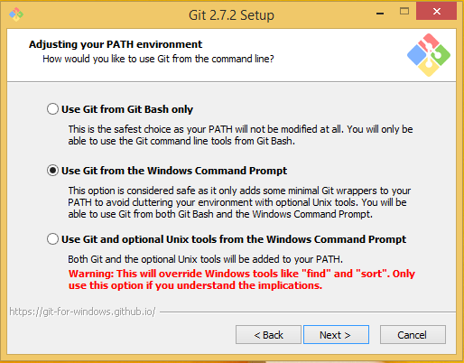
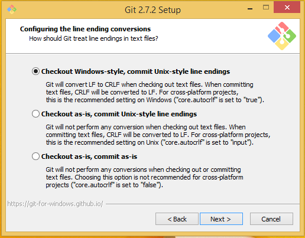
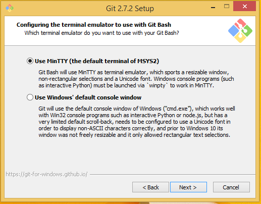
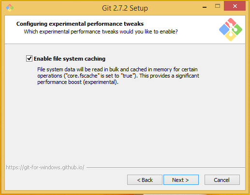

# 

## C’est quoi Git ?

C’est un **gestionnaire de sources**, un peu comme Subversion, mais en 300 000 fois mieux.  À part dans la formation [Git Total](http://www.git-attitude.fr/git-total/), on ne s’en servira cependant que très basiquement (`clone`, `reset --hard`, `checkout`…), pour manipuler la base de code fournie en début d’exercices.

> **Info** Et ça se prononce « guitte », pas « jitte », « djitte » ou « gé-i-té » : c’est un *G dur*. Juste pour ne pas t’attirer le regard courroucé (ou dépité, c’est selon) des formateurs :wink:.

## Version minimale requise

Il est impératif d’utiliser **au grand minimum la version 1.8.5, plutôt une 2.x, et de préférence la dernière version mineure sortie**.  Par exemple, à l’heure où nous écrivons ceci (2 mars 2016), c’est la 2.7.2, qui remonte au 22 février.

Aller directement aux instructions pour…

* [Windows](#sur-windows)
* [OSX](#sur-osx)
* [Linux](#sur-linux)

## Sur Windows

Depuis l’automne 2015, Git for Windows est enfin au taquet par rapport à ses confrères OSX et Linux…  Ouf !

1. [Télécharge la dernière version de l’installeur officiel](https://git-scm.com/download/win).  Vérifie bien, si tu es sur un Windows 64-bit, que ça récupère la 64-bit, sinon annule le téléchargement et choisis le lien approprié sur la page (si tu as les droits d’installation, préfère la version normale à la version « portable »).
2. Lance l’installeur, et suis les étapes…
    1. Commence par accepter la licence
    2. Tant qu’à faire, ajoute les icônes sur le bureau (*“On the Desktop”*)
    3. Choisis de pouvoir utiliser Git tant depuis le *Git Bash* que depuis les invites de commande Windows normales (*“Use Git from the Windows Command Prompt”*)
    4. Laisse la conversion automatique Windows/Unix des fins de ligne (*“Checkout Windows-style, commit Unix-style line endings”*)
    5. Laisse le terminal mieux foutu proposé, MinTTY (*“Use MinTTY (the default terminal of MSYS2)”*)
    6. Assure-toi que la mise en cache du système de fichiers est active (ça compense un peu le ralentissement dû à l’émulation interne) (*“Enable file system caching”*)
    7. On se fout des *Release Notes*, sur ce coup.











Voilà, Git est installé, ainsi que **Git Bash**, que tu utiliseras en formation **Git Total**, et qui est une sorte de terminal avec un *shell* Bash, comme sur un Linux ou un OSX, doté d’une invite de commande personnalisable.  Jamais utilisé une ligne de commande ? Ne panique pas, on t’expliquera tout le moment venu.

Il te reste à [configurer ton Git correctement](#finaliser-ta-configuration-git)…

## Sur OSX

Depuis OSX Lion, OSX inclue un Git, pas nécessairement ancien…  Ainsi, avec Yosemite, on a une 2.4.9 :

```console
$ /usr/bin/git --version
git version 2.4.9 (Apple Git-60)
```

Toutefois, cette version a généralement du retard, et surtout elle n’est pas facile à mettre à jour *in situ*.  On préfèrera donc utiliser une installation fraîche venant d’ailleurs.

### Option 1 : l’installeur officiel

La première façon consiste à utiliser [l’installeur officiel](http://git-scm.com/download/mac), pour l’installation initiale comme pour la mise à jour.

Toutefois, **cette méthode n’est pas idéale**, car la mise à jour nécessite à chaque fois de re-télécharger l’installeur et de l’exécuter à nouveau, et les éventuelles personnalisations associées (complétion, etc.) ne sont pas toujours simples à mettre en œuvre.

Nous te recommandons donc plutôt l’approche Homebrew.

### Option 2 : Homebrew

[Homebrew](http://brew.sh/) est **indispensable pour tous les développeurs utilisant OSX**.  C’est un gestionnaire de paquets qui nous donne accès, facilement et de façon homogène, à la grande majorité des outils Linux / Unix, qu’il s’agisse d’outils « clients », comme Git, ou serveurs, comme MySQL, PostgreSQL, MongoDB, Redis ou que sais-je encore…

Homebrew nécessite Ruby pour s’installer, mais ce n’est pas un souci vu qu’un Ruby suffisamment récent fait partie d’OSX depuis très longtemps.

Homebrew va installer ses données, par défaut, dans `/usr/local`.  Sur une machine de développement mono-utilisateur, il est souhaitable de vous donner une bonne fois pour toutes les droits sur cette arborescence, pour éviter les `sudo` à tout va.  Commence donc par ceci :

```bash
chown -R $USER:staff /usr/local
```

Après quoi, il te suffit donc de lancer cette ligne de commande :

```bash
/usr/bin/ruby -e "$(curl -fsSL https://raw.githubusercontent.com/Homebrew/install/master/install)"
```

Tu as à présent un Homebrew à jour ! :tada:  Il ne te reste plus qu’à installer Git :

```bash
brew install git
```

Il ne te reste plus qu’à [configurer ton Git correctement](#finaliser-ta-configuration-git)…

#### Tu avais déjà Homebrew ?

Pense à mettre à jour sa liste de formules avant d’installer ou de mettre à jour Git :

```bash
brew update
…
brew install git # ou brew upgrade git, si tu avais déjà Git
```

Voici par exemple à quoi ressemble une mise à jour de Git via Homebrew :

```
$ brew ugrade git
==> Upgrading 1 outdated package, with result:
git 2.7.2
==> Upgrading git
==> Downloading https://www.kernel.org/pub/software/scm/git/git-2.7.2.tar.xz
######################################################################## 100.0%
==> make install prefix=/opt/boxen/homebrew/Cellar/git/2.7.2 sysconfdir=/opt/boxen/homebrew/etc CC=clang CFLAGS= LDFLAGS= NO_OPENSSL=1 APPLE_COMMON_CRYPTO=1
==> make CC=clang CFLAGS= LDFLAGS=
==> make clean
==> make CC=clang CFLAGS= LDFLAGS=
==> Downloading https://www.kernel.org/pub/software/scm/git/git-manpages-2.7.2.tar.xz
######################################################################## 100.0%
==> Downloading https://www.kernel.org/pub/software/scm/git/git-htmldocs-2.7.2.tar.xz
######################################################################## 100.0%
==> Caveats
The OS X keychain credential helper has been installed to:
  /opt/boxen/homebrew/bin/git-credential-osxkeychain

The "contrib" directory has been installed to:
  /opt/boxen/homebrew/share/git-core/contrib

Bash completion has been installed to:
  /opt/boxen/homebrew/etc/bash_completion.d

zsh completion has been installed to:
  /opt/boxen/homebrew/share/zsh/site-functions

Emacs Lisp files have been installed to:
  /opt/boxen/homebrew/share/emacs/site-lisp/git
==> Summary
🍺  /opt/boxen/homebrew/Cellar/git/2.7.2: 1,409 files, 236.4M, built in 55 seconds
```

Il ne te reste plus qu’à [configurer ton Git correctement](#finaliser-ta-configuration-git)…

## Sur Linux

Comme toujours avec Linux, **ça dépend de ta distro**.  L’immense majorité des utilisateurs de Linux dans nos formations utilisent une variante de Debian (Debian même, Ubuntu ou Mint).

### Sur Debian / Ubuntu / Mint

Afin d’être au taquet sur les dernières versions, il est largement préférable d’utiliser le [**PPA officiel**](https://launchpad.net/~git-core/+archive/ubuntu/ppa)[^1].  Si tu n’as jamais utilisé de PPA, voici des instructions détaillées.

Il te faut d’abord vous assurer d’avoir la commande `add-apt-repository` disponible ; ce n’est pas le cas par défaut.  Fais ceci pour vérifier :

```
$ add-apt-repository
Error: must run as root
```

Si tu as plutôt un *“Command not found”*, voici comment obtenir la commande :

```
$ sudo apt-get install software-properties-common python-software-properties
```

Nous y voilà.  À présent, ajoute le PPA à tes sources :

```
$ sudo add-apt-repository ppa:git-core/ppa
[sudo] password for your-user-name:
You are about to add the following PPA to your system:
 The most current stable version of Git for Ubuntu.

For release candidates, go to https://launchpad.net/~git-core/+archive/candidate .
 More info: https://launchpad.net/~git-core/+archive/ubuntu/ppa
Press [ENTER] to continue or ctrl-c to cancel adding it

gpg: keyring `/tmp/tmpEFkPPG/secring.gpg' created
gpg: keyring `/tmp/tmpEFkPPG/pubring.gpg' created
gpg: requesting key E1DF1F24 from hkp server keyserver.ubuntu.com
gpg: /tmp/tmpEFkPPG/trustdb.gpg: trustdb created
gpg: key E1DF1F24: public key "Launchpad PPA for Ubuntu Git Maintainers" imported
gpg: Total number processed: 1
gpg:               imported: 1  (RSA: 1)
OK
```

Puis, mets à jour ta liste de paquets :

```
$ sudo apt-get update
```

Et voilà, tu peux maintenant installer Git :

```
$ sudo apt-get install git
…
$ git --version
git version 2.7.2
```

Il ne te reste plus qu’à [configurer ton Git correctement](#finaliser-ta-configuration-git)…

[^1] *Personal Package Archive*, c’est-à-dire une source de paquets maintenue par la communauté (généralement les auteurs ou mainteneurs d’un écosystème précis), hors des sources strictement officielles de la distro.

### Sur les autres distros

#### Option 1 : paquets officiels

Tu peux choisir de **rester sur leurs paquets officiels**.  Auquel cas assure-toi de mettre à jour ta liste de paquets d’abord, puis lance la commande idoine, en `sudo`, depuis ton terminal.

**Fedora, Red Hat (RHEL), CentOS, CloudLinux**

```
$ sudo yum install git # jusqu’à Fedora 21, et pour les autres distros
$ sudo dfn install git # à partir de Fedora 22
```

**Gentoo**

```
$ sudo emerge --ask --verbose dev-vcs/git
```

**Arch Linux**

```
$ sudo pacman -S git
```

**openSUSE**

```
$ sudo zypper install git
```

**FreeBSD**

```
$ cd /usr/ports/devel/git
$ sudo make install
```

**OpenBSD**

```
$ sudo pkg_add git
```

#### Option 2 : compilation des sources

Tu peux aussi choisir de récupérer les sources de la dernière version, et procéder à la compilation par toi-même.

Commence par récupérer le Zip ou le `tar.gz` de la [dernière version](https://github.com/git/git/releases), et décompresse-la.  Puis déplace-toi dans le répertoire obtenu et exécute les commandes suivantes :

```
$ make prefix=/usr/local all doc info
$ sudo make prefix=/usr/local install install-doc install-html install-info
```

## Finaliser ta configuration Git

Pour utiliser Git au mieux, il te faut plusieurs paramétrages :

1. Une **invite** de ligne de commande (*prompt*) qui t’informe et te rattrape par le col le cas échéant ;
2. Une **complétion** de commande intelligente ;
3. Une **configuration globale** de l’outil qui améliore son fonctionnement par défaut.

### Le *prompt*

Par défaut, quand tu ouvres un **Git Bash** dans Windows, ou quand tu ouvres un terminal sur OSX ou Linux, ton invite ressemble à ceci, même au sein d’un dossier versionné par Git :

```
markwatney@hab:farming $
```

Il y a ton nom d’utilisateur, celui de la machine, et le dossier où tu te trouves (soit le nom court, soit le chemin complet).  Mais ça ne te dit pas si tu es dans un contenu versionné, sur quelle branche tu travailles, si tu as des modifications dans le *stage*, des fichiers *untracked*, des conflits, etc.

Ce serait pas mal d’avoir des infos contextuelles, du genre :

```
markwatney@hab:farming (hydrogen-burn u+3 REBASE-i 3/5) $
```

Ici, je sais en plus que :

* Je suis en plein *rebase* interactif de la branche `hydrogen-burn`,
* Je suis à l’étape 3 sur 5 du *rebase*,
* La branch a 3 commits de plus que sa version distante (serveur).

Nous, on aime bien avoir tout ça sous les yeux.

### La complétion

Personne n’aime taper en entier les commandes, arguments, etc.  Ça prête à faute de frappe, ça nécessite de la mémoire, etc.  Mais Git est parfaitement capable de t’aider en complétant, quand tu presses <kbd>Tab</kbd>, les **noms des commandes**, leurs **arguments** (et en fonction du **contexte**, s’il te plaît !), les chemins…

Encore faut-il charger cette complétion dans ton shell.

### La configuration globale

Git a 3 niveaux de configuration, dont 2 nous intéressent :

* La **globale**, qui ne concerne que ton compte utilisateur, mais s’applique par défaut à tous tes dépôts locaux ;
* La **locale**, qui est au niveau de chaque dépôt, et a priorité sur la globale.

Ce sont des fichiers dont la syntaxe rappelle les `.ini` de Windows : des sections identifiées par leurs noms entre crochets (ex. `[core]`), et dedans, des lignes *nom = valeur*.

La configuration globale se trouve dans ton *home directory* (`/home/ton-compte` sur Linux, `/Users/ton-compte` sur OSX, `C:\Users\ton-compte` sur Windows ; on désigne généralement ce dossier par le symbole tilde : `~`), dans un des emplacements suivants, par priorité décroissante :

1. `~/.config/git/config`
2. `~/.gitconfig`

La configuration locale d’un dépôt se trouve toujours dans son fichier `.git/config`.

Hélas, la configuration globale par défaut de Git laisse beaucoup à désirer.  POur en tirer au mieux parti, on va beaucoup l’améliorer !

### Comment configurer tout ça vite fait ?

Pas de problème, on a pensé à toi : il suffit d’exécuter **notre petit script fait avec amour** dans ton terminal (ou Git Bash, sur Windows).  Voici les commandes pour le télécharger et l’exécuter :

```
curl -O https://raw.githubusercontent.com/deliciousinsights/support-files/master/config-git.sh
source ./config-git.sh
```

Si tu as déjà une configuration Git globale, il va la détecter et en préserver les réglages, en priorité sur les siens, au cas par cas (ce qui peut être contre-productif si tes réglages sont discutables).  Il y piochera notamment tes nom complet et e-mail, pour ton identité de *committer*.

Dans le cas contraire, il te demandera ton nom complet (Prénom Nom) et ton e-mail pro, pour caler cette identité.

Ce script va également configurer correctement la complétion et l’invite de commande.

Tu auras peut-être besoin de relancer un terminal / Git Bash pour que tout soit pris en compte.  Tu devrais alors voir une invite colorisée et horodatée, qui ressemblerait à ceci :

```
[10:21] markwatney@hab:~ $
```

Et tu ne devrais pas voir d’erreur du style *“__git_ps1: command not found”*.  Pour bien vérifier que ton invite fonctionne, tente une création de dépôt temporaire :

```
[10:21] markwatney@hab:~ $ cd /tmp
[10:21] markwatney@hab:/tmp $ mkdir foobar
[10:21] markwatney@hab:/tmp $ cd foobar
[10:21] markwatney@hab:/tmp/foobar $ git init
[10:21] markwatney@hab:/tmp/foobar (master #) $
```

Tu devrais bien voir le `(master #)` dans ton invite une fois le `git init` effectué.
