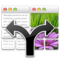
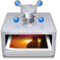

# Divers

Cette section liste quelques petits logiciels qu’on trouve super pratiques au quotidien, mais qui n’ont absolument rien d’obligatoire pour nos formations.  Certains sont gratuits, d’autres payants…  Et comme nous sommes exclusivment sur OSX, certains ne sont *que* sur OSX.  Simples conseils !

##  Alfred 2

<p class="software-info">OSX • Base gratuite, Powerpack payant</p>

[Alfred](https://www.alfredapp.com/) est le compagnon indispensable d’OSX, avec sa recherche avancée, ses *workflows* personnalisables avec raccourcis claviers globaux, ses plugins de pilotage automatique pour de nombreuses fonctions, son presse-papiers avec des mois d’historique…  On n’imagine pas vivre sans.

##  Divvy

<p class="software-info">OSX et Windows • Essai gratuit, puis payant</p>

[Divvy](http://mizage.com/divvy/) est notre façon préférée d’organiser nos fenêtres sur OSX et [Windows](http://mizage.com/windivvy/).  Définis des raccourcis globaux et locaux pour n’importe quel positionnement de fenêtre, avec des gestions de grilles fines, la gestion du multi-écran, etc.  Indispensable en tant que formateur, et très utile en général !

##  F.lux

<p class="software-info">OSX, Windows, Linux, jailbroken iOS • Gratuit</p>

[F.lux](https://justgetflux.com/) sauve tes yeux et tes nuits en adaptant automatiquement la témpérature colorimétrique de ton écran au fil de la soirée, à partir de la tombée de la nuit, pour t’éviter la lumière bleue trop forte dans les yeux le soir (ou dans l’obscurité), qui fatigue tes yeux et rend difficile l’endormissement.  Demande à n’importe qui l’utilisant : l’essayer, c’est l’adopter !

##  Caffeine

<p class="software-info">OSX • Gratuit</p>

[Caffeine](http://lightheadsw.com/caffeine/) est un micro utilitaire OSX qui fournit un icône dans la barre de menus que tu peux utiliser pour empêcher la mise en veille.  Pratique lors d’une formation, d’une présentation, d’un événement, etc. où on peut avoir besoin de garder un écran actif malgré une inactivité potentielle prolongée.

##  ImageOptim

<p class="software-info">OSX • Gratuit</p>

[ImageOptim](https://imageoptim.com/fr.html) enlève toute excuse pour ne pas optimiser correctement les images de tes sites web.  Il fournit une interface graphique triviale à utiliser par-dessus toute une série d’optimiseurs de plus bas niveau, tels qu’OptiPNG, PNGCrush, JpegOptim, Gifsicle, etc.  Il suffit de glisser-déposer tes fichiers (individuellement ou en masse) sur sa fenêtre, et de le laisser faire.

En bon habitué de la ligne de commande que je suis, je me pose toujours une fonction Bash `optim` définie comme suit :

```bash
function optim () {
  open -a ImageOptim.app "$@"
}
```

Ainsi, je n’ai plus qu’à l’appeler avec mes fichiers images, du style :

```bash
$ optim assets/images/*
```

Note qu’îl y a des équivalents Linux et Windows, mais on ne saurait pas trop te conseiller lesquels, ne les utilisant pas…

##  GifGrabber

<p class="software-info">OSX • Gratuit</p>

[GifGrabber](http://www.gifgrabber.com/) est notre outil préféré pour produire vite fait un GIFanim à partir de notre écran, en particulier pour une démo courte d’utilisation de logiciel (souvent en ligne de commande) dans un fichier Markdown, un README sur GitHub par exemple.

Il y a plein d’équivalents Linux et Windows, mais là-aussi, je te laisse chercher…

##  Robomongo

<p class="software-info">OSX, Windows, Linux • Gratuit</p>

[Robomongo](https://robomongo.org/) est sans doute la meilleure GUI pour MongoDB à ce jour.  Financé partiellement en participatif, il est disponible sur OSX, Windows et Linux, gratuitement (des abonnements payants permettent un accès plus rapide aux nouvelles versions et davantage de support).
