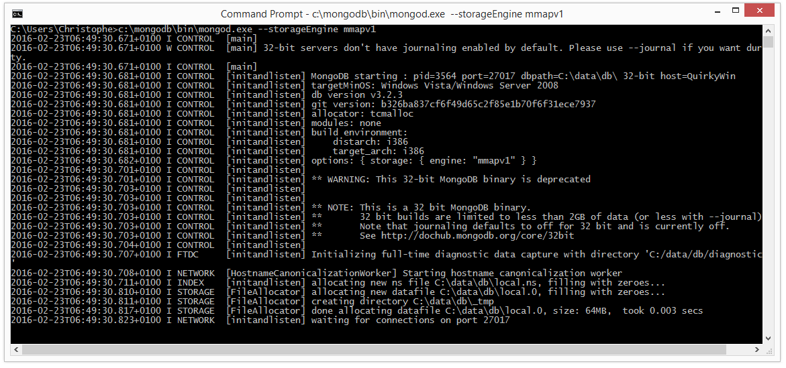
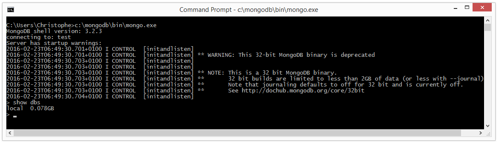

# 

## C’est quoi MongoDB ?

[MongoDB](https://www.mongodb.org/) est une **base de données [NoSQL](https://www.mongodb.com/nosql-explained)** parmi les plus populaires du monde (le principal concurrent étant CouchDB).

On s’en sert pour la persistance de nos données dans la [formation Node.js](../trainings/node.md).

## Sur Windows

[Le guide officiel](https://docs.mongodb.org/manual/tutorial/install-mongodb-on-windows/) est très bien fait, mais en voici le résumé.

On va faire l’impasse sur les Windows Server, en supposant que la machine que amènes utilise un Windows 7 ou ultérieur.

1. **Détermine si tu es en 32-bit ou 64-bit**.  Tu peux être sûr-e rapidement en lançant la commande suivante dans l’Invite de Commande : `wmic os get osarchitecture`.  Note que MongoDB ne fournira bientôt plus de versions 32-bit.
2. [Télécharge la version appropriée](https://www.mongodb.org/downloads) : *Windows 64-bit 2008 R2+** pour du 64-bit, *Windows 32-bit* dans le cas contraire.  Ça affiche un formulaire après, mais tu n’as pas à le remplir : attends simplement la fin du téléchargement.
3. Lance le fichier `.msi` téléchargé.  **Attention, pour te faciliter la vie** et suivre les recommandations de MongoDB, **on va simplifier le chemin** d’installation à `C:\mongodb` (ou sur un autre lecteur si tu n’as pas de place dans `C:\`).
4. Accepte la licence
5. **Choisis le mode *Custom***
6. Laisse tous les composants si tu peux (si tu as besoin de place, ne garde que le serveur et le client, ça économise 200Mo), mais clique *Browse…* pour changer le chemin d’installation : ramène à la racine (`C:`) et clique l’icône en haut à droite de création de nouveau dossier, que tu nommeras `mongodb`.  Ça doit donner un *Folder name* de `C:\mongodb\`.  Clique *OK*, puis *Next*.
7. Clique *Install*, et valide le MSI suivant.
8. Clique *Finish*

Par défaut, le serveur MongoDB va supposer que **tes données sont stockées dans le `\data\db` du même lecteur que le serveur**.  Si tu as un peu de place restante (il en faut peu) sur ce lecteur, parfait, on va faire ça.  Ouvre une **Invite de Commandes** (`cmd.exe`) et crée le dossier :

```
c:
md \data\db
```

Si tu n’as pas de place, crée-le sur une autre lettre de lecteur, et tout-à-l’heure **il faudra préciser le chemin au serveur**.

### Lancer le serveur à la demande

On va vérifier que ton serveur et ton client marchent bien.  Dans une Invite de Commandes, tape maintenant :

```
C:\mongodb\bin\mongod.exe
```

**Note bien le `d` à la fin :** *Mongo Daemon*, le serveur.  Ne pas confondre avec `mongos`, qui est le routeur, ce qui est un autre sujet.

Si tu as installé ailleurs que dans `C:\mongodb`, tu adaptes, évidemment.  Et si tu as créé un dossier de données ailleurs que dans `C:\data\db`, tu le précises :

```
C:\mongodb\bin\mongod.exe --dbpath D:\data\db
```

**Attention**, dans les deux cas, **si tu es en 32-bit, le nouveau moteur de stockage par défaut depuis la 3.2, *WiredTiger*, n’est pas disponible** et tu devras préciser le traditionnel, en sus si besoin du `--dbpath` :

```
C:\mongodb\bin\mongod.exe --storageEngine mmapv1
```

Quand ton lancement fonctionne, Windows te demandera certainement **d’autoriser ce programme à ouvrir son port réseau** en écoute. Autorise-le en mode « Réseaux privés » (cas par défaut).

Un lancement ressemble à ça :



Quand tu n’auras plus besoin du serveur, tu peux l’arrêter proprement en tapant <kbd>Ctrl+C</kbd> dans son terminal, puis en fermant la fenêtre.

### Lancer le client

Une fois ton serveur lancé, tu peux tenter de **lancer le client** en ligne de commande.  Ouvre une nouvelle fenêtre d’Invite de Commandes (laisse celle du serveur tranquille) et tape :

```
C:\mongodb\bin\mongo.exe
```

Ça devrait lancer la **ligne de commande MongoDB**.  Vérifie que tu peux lister les bases par défaut avec `show dbs` :



Le client se termine en tapant <kbd>Ctrl+D</kbd> ou en utilisant la commande `exit`.

## Sur OSX

### Option 1 : Homebrew (recommandé)

Même MongoDB [recommande](https://docs.mongodb.org/manual/tutorial/install-mongodb-on-os-x/#install-mongodb-community-edition) de recourir à **Homebrew** plutôt qu’à une installation manuelle.

[Homebrew](http://brew.sh/) est **indispensable pour tous les développeurs utilisant OSX**.  C’est un gestionnaire de paquets qui nous donne accès, facilement et de façon homogène, à la grande majorité des outils Linux / Unix, qu’il s’agisse d’outils « clients », comme Git, ou serveurs, comme MySQL, PostgreSQL, MongoDB, Redis ou que sais-je encore…

Homebrew nécessite Ruby pour s’installer, mais ce n’est pas un souci vu qu’un Ruby suffisamment récent fait partie d’OSX depuis très longtemps.

Homebrew va installer ses données, par défaut, dans `/usr/local`.  Sur une machine de développement mono-utilisateur, il est souhaitable de vous donner une bonne fois pour toutes les droits sur cette arborescence, pour éviter les `sudo` à tout va.  Commence donc par ceci :

```bash
chown -R $USER:staff /usr/local
```

Après quoi, il te suffit donc de lancer cette ligne de commande :

```bash
/usr/bin/ruby -e "$(curl -fsSL https://raw.githubusercontent.com/Homebrew/install/master/install)"
```

Tu as à présent un Homebrew à jour ! :tada:  Il ne te reste plus qu’à installer MongoDB :

```bash
brew install mongodb
```

#### Tu avais déjà Homebrew ?

Pense à mettre à jour sa liste de formules avant d’installer ou de mettre à jour MongoDB :

```bash
brew update
…
brew install mongodb # ou brew upgrade mongodb, si tu avais déjà Git
```

#### Lancer le serveur

L’installation se termine en précisant ceci :

```
To have launchd start mongodb at login:
  ln -sfv /usr/local/homebrew/opt/mongodb/*.plist ~/Library/LaunchAgents
Then to load mongodb now:
  launchctl load ~/Library/LaunchAgents/homebrew.mxcl.mongodb.plist
Or, if you don't want/need launchctl, you can just run:
  mongod --config /usr/local/homebrew/etc/mongod.conf
```

**Par défaut, MongoDB ne se lancera pas automatiquement avec ta session** (et si tu t’en sers peu, c’est du coup tant mieux).  Pour le lancer manuellement, tu peux soit passer par  :

```bash
launchctl load ~/Library/LaunchAgents/homebrew.mxcl.mongodb.plist
```

(Tu arrêterais alors le serveur avec la même commande, mais en `unload`)

Soit plutôt en « pur direct » :

```bash
mongod --config /usr/local/homebrew/etc/mongod.conf
```

Dans ce dernier cas, tu arrêtes le serveur en frappant <kbd>Ctrl+C</kbd>.

Une fois le serveur lancé, vérifie en ouvrant un nouvel onglet de Terminal et en lançant le client :

```
$ mongo
MongoDB shell version: 3.2.3
connecting to: test
> show dbs
local   0.078GB
>
```

### Option 2 : Installation manuelle

Tu ne devrais pas avoir besoin, mais si tu insistes, [les instructions sont ici](https://docs.mongodb.org/manual/tutorial/install-mongodb-on-os-x/#install-mongodb-community-edition-manually) (ça ressemble pas mal à ce qu’on fait sur Windows, mais sans installeur officiel).

## Sur Linux

### Option 1 : les paquets officiels

MongoDB maintient des paquets officiels pour les univers Debian / Ubuntu, Red Hat / CentOS, et SUSE.  Sinon, on télécharge manuellement les binaires.

Comme l’indiquent les docs officielles, on a plusieurs paquets, les deux plus importants étant `mongodb-org-server` et `mongodb-org-shell`.  Un meta-paquet `mongodb-org` les inclue ainsi que deux autres (routeur, outils).  Et les paquets du dépôt officiel MongoDB sont, comme d’hab, nettement plus à jour que ceux du dépôt standard de la distro.

L’installation elle-même varie d’une distro à l’autre, mais ensuite le lancement du serveur et ses logs sont identiques (voir plus bas).

#### Sur Ubuntu / Debian

> **Caution** MongoDB ne fournit des paquets officiels que pour les versions 64-bit, en limitant aux deux dernières LTS d’Ubuntu (au 4 mars 2016, ce sont la 12.04 et la 14.04) et à la dernière Debian (Wheezy, là tout de suite).

Commence par ajouter la clé officielle de MongoDB à ton APT :

```
$ sudo apt-key adv --keyserver hkp://keyserver.ubuntu.com:80 --recv EA312927
```

Ensuite ajoute les sources du dépôt officiel MongoDB :

```
# Pour du Ubuntu 12.04 :
$ echo "deb http://repo.mongodb.org/apt/ubuntu precise/mongodb-org/3.2 multiverse" | sudo tee /etc/apt/sources.list.d/mongodb-org-3.2.list

# Pour du Ubuntu 14.04 :
$ echo "deb http://repo.mongodb.org/apt/ubuntu trusty/mongodb-org/3.2 multiverse" | sudo tee /etc/apt/sources.list.d/mongodb-org-3.2.list

# Pour du Debian Wheezy :
$ echo "deb http://repo.mongodb.org/apt/debian wheezy/mongodb-org/3.2 main" | sudo tee /etc/apt/sources.list.d/mongodb-org-3.2.list
```

Et on recharge…

```
$ sudo apt-get update
```

Y’a plus qu’à installer.  Pour la totale :

```
$ sudo apt-get install -y mongodb-org
```

#### Sur Red Hat / CentOS

> **Caution** MongoDB ne fournit des paquets officiels que pour les versions 6 et 7 de RHEL et CentOS, en 64-bit.

Commence par créer la définition du dépôt dans `/etc/yum.repos.d/mongodb-org-3.2.repo`, avec le contenu suivant :

```ini
[mongodb-org-3.2]
name=MongoDB Repository
baseurl=https://repo.mongodb.org/yum/redhat/$releasever/mongodb-org/3.2/x86_64/
gpgcheck=0
enabled=1
```

Puis installe MongoDB :

```
$ sudo yum install -y mongodb-org
```

Pour lancer le serveur, il y a un certain nombres de [prérequis](https://docs.mongodb.org/manual/tutorial/install-mongodb-on-red-hat/#prerequisites) à respecter, ayant trait à SELinux et aux permissions sur le dossier de données.  Je te laisse vérifier et choisir ton approche dans la doc que je viens de lier.

#### Sur SUSE

> **Caution** MongoDB ne fournit des paquets officiels que pour les versions 64-bit de SUSE.

Commence par ajouter le dépôt à Zypper :

```
$ sudo zypper addrepo --no-gpgcheck https://repo.mongodb.org/zypper/suse/$(sed -rn 's/VERSION=.*([0-9]{2}).*/\1/p' /etc/os-release)/mongodb-org/3.2/x86_64/ mongodb
```

Puis installe MongoDB :

```
$ sudo zypper -n install mongodb-org
```

#### Lancer le serveur

Pour les trois types de Linxu, on lance le serveur via Upstart, comme d’hab :

```
$ sudo service mongod start
```

Tu peux vérifier qu’il tourne en consultant `/var/log/mongodb/mongod.log` et/ou en ouvrant le client :

```
$ mongo
…
> show dbs
local   0.078GB
>
```

### Option 2 : télécharger les binaires directement

C’est moins fun, évidemment, mais si tu dois…  [Les instructions sont ici](https://docs.mongodb.org/manual/tutorial/install-mongodb-on-linux/).
