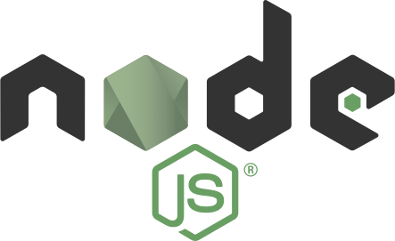
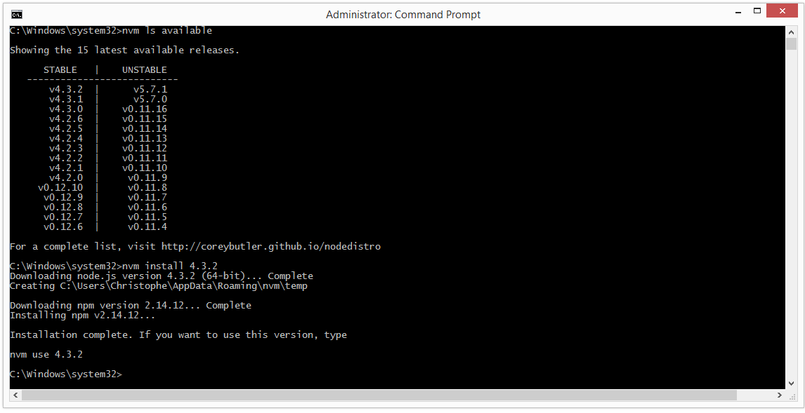

# 

## C’est quoi Node ?

Node (dont le nom complet est « Node.js ») est une **runtime**, un environnement d’exécution autonome, pour le langage **JavaScript**.  C’est un peu comme la JVM, qui initialement visait surtout le langage Java.

De la même manière qu’on peut faire tourner d’autres langages sur la JVM, comme Scala, Clojure, JRuby, etc. on peut faire tourner d’autres langages sur Node, comme CoffeeScript, TypeScript, ClojureScript, etc.

Énormément de gens utilisent Node non pas pour faire tourner leur propre JavaScript dessus, mais pour **tirer parti de la pléthore d’outils de développement** basés dessus (ex. Grunt, Gulp, Yeoman, PhoneGap / Cordova, Brunch, Webpack, Broccoli, Electron, Azure CLI…) ou pour **gérer leurs dépendances à des bibliothèques JavaScript et/ou CSS** open-source (ex. jQuery et ses plugins, Lo-Dash, Moment.js, Bootstrap, Material UI, Compass, Foundation…).

> **Info** Après beaucoup de temps passé en versions **0.10.x**, qui font encore aujourd’hui tourner la majorité du **Fortune 500**, l’écosystème Node a connu un **schisme** début 2015 en raison de la lenteur excessive des évolutions du noyau par un groupe étroit et fermé de développeurs chez Joyent, donnant naissance à **io.js**, lequel a immédiatement produit des versions majeures tous les 3 mois, jusqu’à la 3.0 à l’été 2015, fédérant des centaines de contributeurs.
>
> Au travers de l’été 2015, **io.js a atteint son objectif :** sortir Joyent de sa torpeur et avancer vers un modèle de gouvernance beaucoup plus ouvert et un **noyau unique beaucoup plus réactif**.  La **fondation Node** en est issue, depuis décembre 2015, et il n’existe donc plus qu’un noyau, très actif, et doté de versions LTS (*Long-Term Support*) pour les projets stratégiques et les grosses entreprises.  Une version majeure sort tous les 6 à 9 mois ; avril 2016 va voir arriver Node 6.0.
> 
> 

## Version minimale requise

Même si Node 0.10 est extrêmement stable, vu qu’elle cessera d’être maintenue le 1er octobre 2016 il est conseillé d’utiliser *a minima* **la dernière version LTS** (jusqu’en avril 2017, c’est la branche **4.x**, soit début mars 2016 la 4.3.2).

Si tu es sur des projets expérimentaux, ou que tu as confiance dans la capacité des mainteneurs de ton projet à **mettre à jour** sur la dernière version Node stable au fil du temps, tu peux aussi utiliser la **dernière version stable**.  Début mars 2016, c’est la branche 5.x (la 5.7.1), et la **6.0** arrivera début avril.

L’avantage de suivre les versions stables, c’est qu’elles ont les meilleures performances et sont le plus à jour sur les nouveautés du langage (ES2015, ES2016, etc.).

Aller directement aux instructions pour…

* [Windows](#sur-windows)
* [OSX](#sur-osx)
* [Linux](#sur-linux)

## Sur Windows

Tu peux utiliser soit **l’installeur officiel** (une seule version installée à un moment donné), soit passer par **NVM pour Windows** (bascule facile entre les versions).

### Option 1 : version unique avec l’installeur officiel

Va sur [la liste des installeurs officiels](https://nodejs.org/en/download/), choisis ton approche (dernière LTS ou dernière stable), puis clique sur l’installeur Windows (préfère la version MSI, et assure-toi que si ton Windows est 64-bit, tu prends bien la version 64-bit aussi).

Ensuite exécute l’installeur :

1. Accepte la licence
2. Tu peux laisser le chemin par défaut
3. Tous les réglages par défaut sont bons (*runtime*, gestionnaire de modules `npm`, documentation en ligne et ajout au `PATH`, très important)

Comme tous les choix par défaut sont adaptés, on ne t’a pas mis les captures d’écran : fais juste *Next* à chaque fois :wink: et valide les demandes d’autorisation d’installation.

Assure-toi ensuite [d’avoir npm 3.7 au minimum](#utiliser-le-dernier-npm).

### Option 2 : versions multiples avec NVM

Si tu souhaites jouer entre les versions (par exemple les dernières 0.12, LTS et stable, pour des raisons de portabilité et de tests), le plus simple est de préférer l’approche [NVM pour Windows](https://github.com/coreybutler/nvm-windows#readme).

NVM signifie *Node Version Manager*, et permet d’installer rapidement toute version connue, et de basculer d’une version à l’autre en fonction du projet.  Il y a même un installeur.  Voici comment procéder :

1. Va sur la [liste des versions](https://github.com/coreybutler/nvm-windows/releases)
2. Dans la plus récente, télécharge `nvm-setup.zip`
3. Décompresse-le puis exécute le programme qu’il contient
4. Accepte la licence et les chemins par défaut
5. Si tu as déjà un Node global installé classiquement, nvm te demandera si tu veux qu’il prenne la main sur cette version aussi ; réponds *Yes*.
6. Décoche la case *“Run cmd.exe”*

NVM pour Windows nécessite une invite de commande executée en mode Administrateur.  Sur les Windows récents, il te suffit de cliquer bouton droit sur l’icône et de choisir “Run as Administrator”.  Tu peux alors juste taper `nvm` pour avoir l’aide, et `nvm ls` confirmera qu’il a pris en charge ta version globale précédente, le cas échéant :


Pour savoir quelles versions sont disponibles, utilise `nvm ls available`.  Puis installe avec `nvm install la-version`.  Par exemple :

```
nvm ls available
nvm install 4.3.2
nvm install 0.12.10
```



Assure-toi ensuite [d’avoir npm 3.7 au minimum](#utiliser-le-dernier-npm).

## Sur OSX

### Option 1 : l’installeur officiel

La première façon consiste à utiliser [l’installeur officiel](https://nodejs.org/en/download/), pour l’installation initiale comme pour la mise à jour.

Toutefois, **cette méthode n’est pas idéale**, car la mise à jour nécessite à chaque fois de re-télécharger l’installeur et de l’exécuter à nouveau, et on ne peut travailler qu’avec une version à un moment donné.

Nous te recommandons donc plutôt l’approche NVM.

### Option 2 : NVM

Si tu souhaites jouer entre les versions (par exemple les dernières 0.12, LTS et stable, pour des raisons de **portabilité** et de **tests**), le plus simple est de préférer l’approche [NVM](https://github.com/creationix/nvm#readme).

NVM signifie *Node Version Manager*, et permet **d’installer rapidement toute version connue**, et de basculer d’une version à l’autre en fonction du projet.  Voici comment procéder.

Il faut déjà **avoir un compilateur** disponible sur la machine, ce qui est une excellente idée de toutes façons pour les optimisations binaires de modules par la suite.

Si tu n’a pas les **XCode Command Line Tools** installés, voici comment les obtenir gratuitement et rapidement (à partir de OSX Mountain Lion) :

1. Ouvre *Terminal* (utilise la recherche système pour le trouver, sinon, il est dans Applications > Utilitaires)
2. Tape `xcode-select -install`
3. Clique *Install* (et **pas** *“Get Xcode”*)
4. Laisse le téléchargement (~130 Mo) se faire
5. Une fois l’installation terminée, tente une commande du style `gcc -v` dans le terminal : tu devrais voir un truc du genre *Apple LLVM version 7.0.0*

Tu peux alors **installer nvm**.  Début mars 2016, la dernière version est la 0.31, ça donne ça :

```bash
curl -o- https://raw.githubusercontent.com/creationix/nvm/v0.31.0/install.sh | bash
```

Note que cette même commande assurera la **mise à jour** de nvm aussi, si besoin.

Ouvre un nouveau terminal (<kbd>Cmd+T</kbd> ouvrira un nouvel onglet), puis liste les versions disponibles avec `nvm ls-remote`.  Il y en a **une tonne**, alors tu peux choisir de limiter aux 4.x à 6.x, par exemple :

```
$ nvm ls-remote 'v[456]*'
         v4.0.0
         v4.1.0
         v4.1.1
         v4.1.2
         v4.2.0
         v4.2.1
         v4.2.2
         v4.2.3
         v4.2.4
         v4.2.5
         v4.2.6
         v4.3.0
         v4.3.1
         v4.3.2
         v5.0.0
         v5.1.0
         v5.1.1
         v5.2.0
         v5.3.0
         v5.4.0
         v5.4.1
         v5.5.0
         v5.6.0
         v5.7.0
         v5.7.1
$
```

Tu peux installer une version avec `nvm install` :

```
$ nvm install v5.7.1
######################################################################## 100.0%
Checksums empty
Now using node v5.7.1
$
```

Et même en faire la version par défaut, si tu veux :

```
$ nvm alias default v5.7.1
default -> v5.7.1
$
```

Par exemple, le `nvm ls` de Christophe dit ça, là tout de suite :

```
$ nvm ls
       v0.10.38
        v0.12.7
         v4.2.6
->       v5.7.1
         system
default -> v5.7.1
node -> stable (-> v4.2.6) (default)
stable -> 4.2 (-> v4.2.6) (default)
unstable -> 5.7 (-> v5.7.1) (default)
iojs -> iojs- (-> system) (default)
```

Pour finir, assure-toi ensuite [d’avoir npm 3.7 au minimum](#utiliser-le-dernier-npm).

## Sur Linux

Comme toujours avec Linux, **ça dépend de ta distro**.  L’immense majorité des utilisateurs de Linux dans nos formations utilisent une variante de Debian (Debian même, Ubuntu ou Mint).

### Option 1 : paquets officiels

> **Info** [NodeSource](https://nodesource.com/) maintient des paquets officiels à jour pour l’univers Debian et les “Enterprise Linux”.  Il faut choisir sa version de base, cependant (4.x ou 5.x, début mars 2016, plus les 0.12, 0.10 et io.js 1–3 par souci de rétrocompatibilité).  Pour le reste, ça sent la compilation des sources…

#### Sur Debian / Ubuntu / Mint

Une fois choisie ta version de base, tu configures les sources adaptées via le bon script en ligne, puis installe le paquet (qui s’appelle toujours `nodejs`).[Les instructions détaillées sont ici](https://github.com/nodesource/distributions#debian-and-ubuntu-based-distributions), mais voici un exemple pour Node 5.x :

```
# Sur Ubuntu / Mint :

$ curl -sL https://deb.nodesource.com/setup_5.x | sudo -E bash -
$ sudo apt-get install -y nodejs

# Sur Debian (en root dès le départ) :

$ curl -sL https://deb.nodesource.com/setup_5.x | bash -
$ apt-get install -y nodejs
```

Ce serait bien aussi d’avoir les outils de compilation à dispo, pour optimiser les modules binaires :

```
$ sudo apt-get install -y build-essential
```

Mais n’oublie pas : tu as aussi [l’approche nvm](#option-3--nvm) !

Pour finir, assure-toi ensuite [d’avoir npm 3.7 au minimum](#utiliser-le-dernier-npm).

#### Sur les “enterprise Linux” (Fedora, Red Hat (RHEL), CentOS, CloudLinux)

Une fois choisie ta version de base, tu configures les sources adaptées via le bon script en ligne, puis installe le paquet (qui s’appelle toujours `nodejs`).[Les instructions détaillées sont ici](https://github.com/nodesource/distributions#enterprise-linux-based-distributions), mais voici un exemple pour Node 5.x :

```
curl -sL https://rpm.nodesource.com/setup_5.x | bash -
```

Puis en `root` :
```
yum install -y nodejs
```

Note que sur les EL5 (RHEL 5 et CentOS 5), il te faudra le dépôt EPEL disponible (le script d’install t’indiquera comment faire, si besoin).

Ce serait bien aussi d’avoir les outils de compilation à dispo, pour optimiser les modules binaires (en `root`) :

```
# Variante 1 : ciblé
yum install gcc-c++ make

# Ou variante 2 : tout le groupe
yum groupinstall 'Development Tools'
```

Pour finir, assure-toi ensuite [d’avoir npm 3.7 au minimum](#utiliser-le-dernier-npm).

### Option 2 : compilation des sources

Si tu utilises un autre distro, tu peux toujours [récupérer les sources](https://nodejs.org/en/download/), les décompresser puis les compiler.  Note qu’il te faudra d’abord :

* Un compilo (GCC ou G++ 4.8 ou ultérieur)
* Un lieur (CLANG ou CLANG++ 3.4 ou ultérieur)
* Python 2.6 et 2.7
* GNU Make 3.81 ou ultérieur
* Sur les BSD, `libexecinfo`

```
$ ./configure
$ make
$ sudo make install
```

Mais bon, franchement, snif.

### Option 3 : NVM

Sur Debian, Ubuntu et Mint, tu peux jouer entre différentes versions grâce à [nvm](https://github.com/creationix/nvm#readme).

NVM signifie *Node Version Manager*, et permet **d’installer rapidement toute version connue**, et de basculer d’une version à l’autre en fonction du projet.  Voici comment procéder.

Il faut déjà **avoir un compilateur** disponible sur la machine, ce qui est une excellente idée de toutes façons pour les optimisations binaires de modules par la suite, ainsi que les en-têtes de compilation de la `libSSL`.  Ça s’installe comme ça :

```
$ sudo apt-get install -y build-essential libssl-dev
```

Tu peux alors **installer nvm**.  Début mars 2016, la dernière version est la 0.31, ça donne ça :

```bash
curl -o- https://raw.githubusercontent.com/creationix/nvm/v0.31.0/install.sh | bash
```

Note que cette même commande assurera la **mise à jour** de nvm aussi, si besoin.

Ouvre un nouveau shell puis liste les versions disponibles avec `nvm ls-remote`.  Il y en a **une tonne**, alors tu peux choisir de limiter aux 4.x à 6.x, par exemple :

```
$ nvm ls-remote 'v[456]*'
         v4.0.0
         …
         v4.3.2
         v5.0.0
         …
         v5.7.1
$
```

Tu peux installer une version avec `nvm install` :

```
$ nvm install v5.7.1
######################################################################## 100.0%
Checksums empty
Now using node v5.7.1
$
```

Et même en faire la version par défaut, si tu veux :

```
$ nvm alias default v5.7.1
default -> v5.7.1
$
```

Par exemple, le `nvm ls` de Christophe dit ça, là tout de suite :

```
$ nvm ls
       v0.10.38
        v0.12.7
         v4.2.6
->       v5.7.1
         system
default -> v5.7.1
node -> stable (-> v4.2.6) (default)
stable -> 4.2 (-> v4.2.6) (default)
unstable -> 5.7 (-> v5.7.1) (default)
iojs -> iojs- (-> system) (default)
```

## Utiliser le dernier npm

Par « npm », on désigne à la fois l’outil disponible sur nos machines et le référentiel central en ligne de modules utilisables.  C’est l’écosystème le plus vivace toutes technos confondues, avec près de **250 000 modules** début mars 2016, et plus de [400 nouveaux modules tous les jours](http://www.modulecounts.com/) !  Le référentiel est utilisé pour plus de **3,5 <u>milliards</u> de téléchargements par mois**.  Imaginez un peu ; et ça ne fait qu’augmenter…

> **Info** « npm » ne signifie pas “Node Package Manager”, comme beaucoup le croient, mais “Node Packaged Modules”, et s’écrit toujours en minuscules.

Avant sa version 3, l’outil `npm` installait ses modules sous forme d’une **arborescence récursive** sur le disque, ce qui pouvait vite entraîner des **chemins très longs** et ne facilitait pas le **dédoublonnement** des versions identiques et la **montée automatique en version compatible**.

C’était particulièrement un **problème sur Windows**, qui limite ses chemins à la taille ridicule de 256 caractères…

À partir de la **version 3**, les dépendances sont toujours analysées et traitées récursivement, et on est toujours garantis sans conflits de versions locales, mais les modules sont **déposés à plat sur le disque**, ce qui réduit considérablement les tailles de chemin, et facilite grandement la vie à Windows, en plus de réduire la place occupée en **dédoublonnant automatiquement** et de facilier la montée automatique en version compatible.

Cependant, les version 3.0 à 3.6 avaient de **sacrés soucis de lenteur**.  La 3.7 a commencé à bien corriger le tir.

Assure-toi donc d’avoir **le tout dernier npm**, quelle que soit ta version de Node, en utilisant npm pour **se mettre à jour lui-même** (meta !) :

```
$ npm install -g npm@latest
```

> **Caution** Si tu es sur un Node global sur Linux ou OSX, sans avoir les droits sur `/usr/local`, tu devras faire cette commande en `sudo`.

Vérifie que tu es au moins en 3.7 :

```
$ npm -v
3.7.5
$
```
