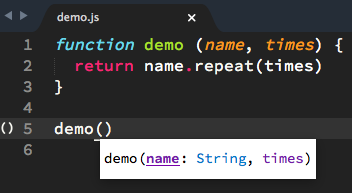
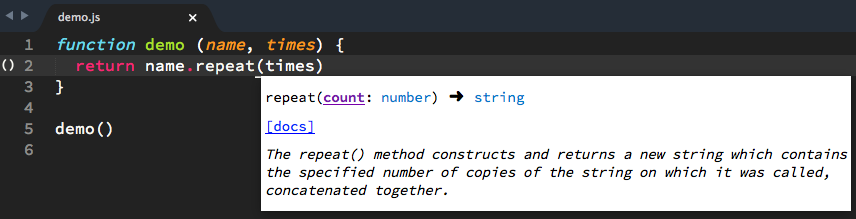

# Configurer TernJS

:point_right: [Vite, la config !](#configuration-du-serveur-ternjs) :point_left:

## C’est quoi TernJS ?

**JavaScript est un langage extrêmement dynamique**, et il existe des *tonnes* de façons de modifier un objet, directement ou indirectement ; on peut remplacer son prototype à la volée, modifier l’existant, toucher à un objet le long de sa chaîne de prototypes, modifier un descripteur de propriété, utiliser une boucle d’affectation de propriétés par indexation indirecte, ou `Object.assign`, ou le *object spread* d’ES7+, et tout ça sans compter les imports et exports entre modules, et d’autres formes encore.

**Analyser statiquement** du code JS moderne pour en déduire avec **suffisamment d’exactitude** la forme des objets et, partant, remonter sur des descriptions fiables de listes d’arguments, de types de retour, etc. **n’est pas une mince affaire**.

C’est sans doute pour ça que la majorité des EDIs et éditeurs ne proposent en fait qu’une **approche minimaliste**, souvent limitée au fichier courant pour la partie « dynamique », et souvent basée sur des définitions statiques de typage (telles que des fichiers `.d.ts` issus de [DefinitelyTyped](http://definitelytyped.org/)) pour le reste.

Oui, c’est déjà pas mal, mais ça ne fournit qu’une toute petite partie des infos, notamment pour *ton* code (ou celui du projet en général, par opposition à celui de bibliothèques et environnements tierces).  Du coup, tu risques de faire *trop* confiance à la complétion ou aux descriptions fournies, et mal interpréter ou utiliser le code.

C’est pourquoi on cherche un **analyseur vraiment poussé**.  Et à ce jour, **le meilleur, c’est TernJS**.  Il est fait par [Marijn Haverbecke](https://marijnhaverbeke.nl/), qui est aussi l’auteur, entre autres, des célébrissimes bouquin [Eloquent JavaScript](http://eloquentjavascript.net/) et éditeur en ligne [CodeMirror](http://codemirror.net/), pour ne nommer que ces deux projets.  Marijn, **il maîtrise en JS**.

## Un mot sur le fonctionnement de TernJS

Tern est encore en développement actif, en « alpha » pratiquement, mais ça envoie déjà bien du pâté.  En revanche, il faut le configurer soigneusement.

Il utilise un **serveur**, lancé à la volée, qui s’éteint tout seul après une quinzaine de minutes pour se relancer plus tard au besoin.  Ce serveur analyse en arrière-plan l’ensemble des fichiers qui « le concernent » (et c’est là où il faut éviter de lui donner une tonne de trucs, genre tout ton dossier `node_modules`, par exemple, car ça va prendre beaucoup de temps).

Pour les environnements établis, on a des définitions de typage pré-établies dans le dossier `defs` du code de Tern.  On y trouve notamment ES5, ES6, jQuery, Underscore, Chai et les objets globaux fournis par le navigateur.  Le noyau de Node est aussi disponible.

Ensuite, on a des **plugins** qui, d’une part, permettent d’indiquer le genre de syntaxes qu’on souhaite prendre en charge pour étendre l’analyse (par exemple, les modules CommonJS, AMD ou ES6), et d’autre part jouent le rôle du client pour le serveur, et intègrent les fonctionnalités basées sur Tern dans un éditeur (CodeMirror, Sublime Text, Emacs, Vim, Brackets…) ou EDI (Eclipse, par exemple).  Note que la partie « serveur » peut aussi tourner directement dans le navigateur, et donc fournir la complétion dans un environnement 100% « client ».

## Configuration du serveur TernJS

Chaque projet où tu veux utiliser TernJS devrait définir à sa racine un fichier `.tern-project`, qui est en JSON et le renseigne sur tes besoins.  J’utilise en général quelque chose de ce genre :

```json
{
  "plugins": {
    "node": true,
    "es_modules": true
  }
}
```

Je lui signifie ainsi que j’utilise les modules ES6, ainsi que ceux issus de Node et de npm, et qu’il devrait donc prendre ces imports, exports, `require` et dossiers `node_modules` en charge.

## Configuration du plugin `tern_for_sublime`

Par défaut, le plugin fournit [quelques raccourcis-claviers](https://packagecontrol.io/packages/tern_for_sublime#readme) (dont certains ne marcheront pas tels quels sur un clavier OSX français, il faudra les ajuster).

Mais on veut souvent activer d’autres aspects : l’affichage par infobulles plutôt que dans la barre d’état, la complétion des arguments et les signatures en infobulles, etc.

Par ailleurs, le serveur Tern, quand il se lance, écrit son port réseau local dans un fichier `.tern-port` dans le dossier qu’il est en train d’analyser, pour permettre à d’autres « clients » de le réutiliser sans en lancer une autre instance.

En pratique, mon seul client est mon Sublime, et le client est donc unique. Du coup, je m’évite de polluer mes dossiers de code avec ces fichiers.

Sélectionne le menu *Preferences > Package Settings > Tern > Settings - User*, et mets-y ceci :

```json
{
    "tern_argument_hints": true,
    "tern_output_style": "tooltip",
    "tern_argument_completion": true,
    "tern_command": [
      "node",
      "<le-chemin-complet-de-tern-dans-ton-paquet-sublime>",
      "--no-port-file"
    ]
}
```

Par exemple, sur OSX, le chemin complet pour moi est ici :

```js
"/Users/tdd/Library/Application Support/Sublime Text 3/Packages/tern_for_sublime/node_modules/tern/bin/tern"
```

Par ailleurs, si tu utilises NVM uniquement, tu voudras sans doute préciser la version de Node à utiliser (voire tu n’auras pas `node` dans ton `PATH` par défaut), du coup tu précises le premier élément de `tern_command` plus avant.  Pour moi par exemple ça pourrait donner ça :

```js
"/Users/tdd/.nvm/versions/node/v4.3.2/bin/node"
```

Reste à vérifier le bon fonctionnement ; garde la console de Sublime ouverte, à l’affût de messages d’erreur.  Voici un petit fichier de test à exploiter (n’oublie pas de le sauver sur disque avec une extension `.js`) :

```js
function demo (name, times) {
  return name.repeat(times)
}

demo()
```

Si ton paramétrage Tern fonctionne correctement, tu devrais voir, d’une part, l’infobulle sur les arguments de `demo` dans la dernière ligne :



Et d’autre part, si tu mets le curseur dans les arguments de `repeat` sur la 2e ligne, tu devrais voir une infobulle décrivant la méthode `repeat` de `String` (Tern a deviné, vu le nom de la méthode, que `name` était une `String`), avec un lien vers le MDN.


